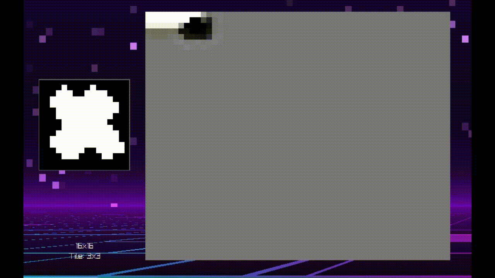
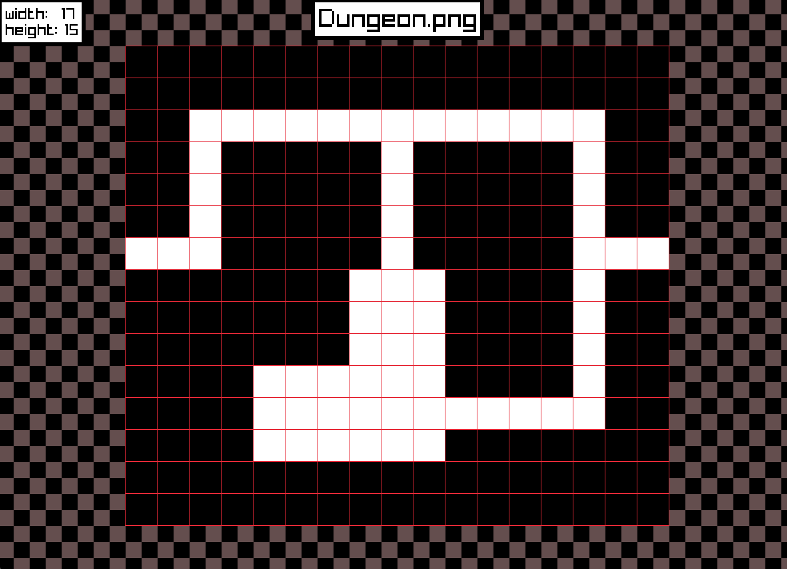
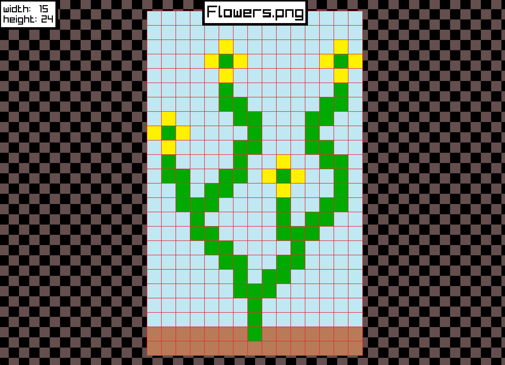
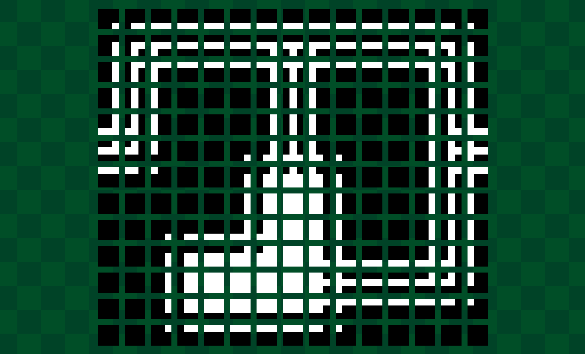
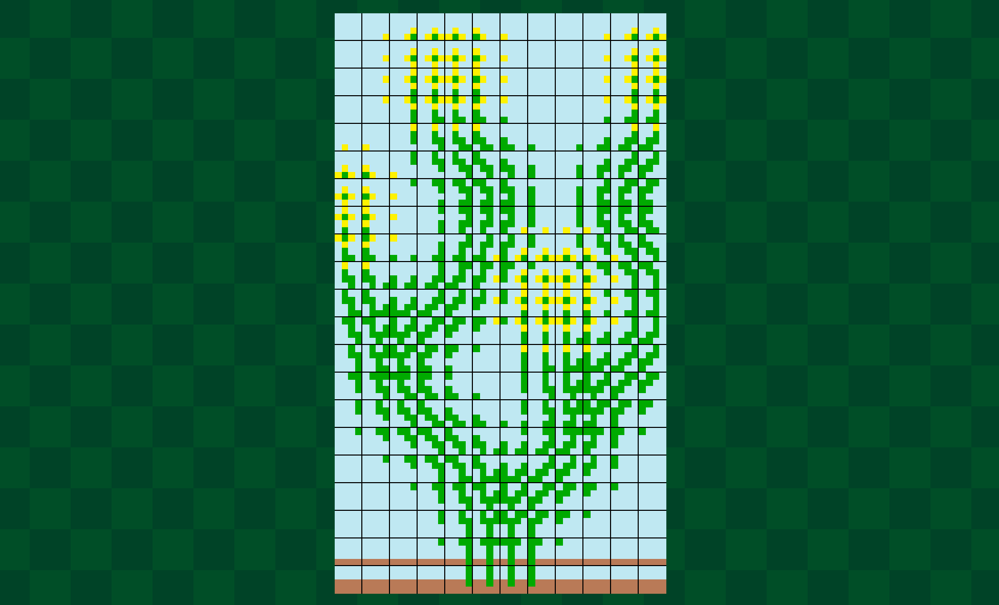

# Wave Function Collapse Image Generator

<p align="center">
  
</p>

  

A C++ procedural generation tool that implements the Wave Function Collapse algorithm. Give it a sample image and it generates new images that look locally similar — same patterns, new arrangement.

## What is Wave Function Collapse?

WFC works by extracting every overlapping NxN tile from a source image, learning which tiles can appear next to each other, then building a new image from scratch by iteratively placing tiles that satisfy those constraints. It uses Shannon entropy to decide which cell to collapse next — always picking the most constrained position first — and backtracks if it hits a contradiction.

This project uses the **overlapping model** variant, which operates at the pixel level for fine-grained visual coherence with the source material.

## How It Works — Visual Pipeline

**Stage 1 — Map the extraction grid**

The input image is loaded and divided into overlapping NxN windows. The red grid shows every position where a pattern will be sampled.

<p align="center">
  
  
</p>
<p align="center"><i>Dungeon and Flower samples with pattern extraction grid overlaid</i></p>

**Stage 2 — Extract the tile patterns**

Each window position becomes an individual tile. The system catalogs every unique pattern it finds and records which ones can legally appear next to each other — building the constraint database WFC will use during generation.

<p align="center">
  
  
</p>
<p align="center"><i>Extracted tile patterns from the Dungeon and Flower samples</i></p>

## Building

**Requirements:** C++ compiler and [raylib](https://www.raylib.com/) installed on your system.

The makefile is in `src/`. By default it's set up for WSL. If you're on **macOS**, open `src/makefile` and swap the platform lines:

```makefile
# Uncomment mac, comment out WSL:
PLATFORM = mac
#PLATFORM = WSL
```

Then build from the `src/` directory:

```bash
cd src/
make            # builds the main capstone executable
make all        # builds all executables
make clean      # removes built executables
```

Other build targets:
```bash
make demoApp        # raylib sanity check — run this first on a new machine
make drawImage      # pattern extraction visualizer
make drawTileOptions
```

## Running

```bash
./capstone                               # main WFC tool (default: Flowers.png, 3x3 tiles, 55x45 output)
./drawImage                              # visualize pattern extraction (default: assets/City.png)
./drawImage --image assets/Flowers.png   # use a different sample image
./demoApp                                # graphics test — just verifies raylib is working
```

### capstone CLI flags

| Flag | Argument | Description | Default |
|------|----------|-------------|---------|
| `--image` | `<path>` | Input sample image | `assets/Flowers.png` |
| `--tile` | `<N>` | Tile/pattern size (NxN pixels) | `3` |
| `--size` | `<W> [H]` | Output grid dimensions in cells | `55x45` |
| `--generate` | — | Auto-start generation on launch | off |

```bash
./capstone --image assets/Dungeon.png --tile 5 --size 80 60 --generate
```

### Keybindings

| Key | Action |
|-----|--------|
| `G` | Run full generation |
| `S` | Step one cell forward |
| `Shift+S` | Step continuously (hold) |
| `R` | Reset with a new random seed |
| `Shift+R` | Reset with the same seed (replay) |
| `X` | Toggle x-ray mode (highlights uncollapsed cells) |
| `V` | Toggle rough color preview for uncollapsed cells |
| `B` | Cycle background shader (grid → CRT → plasma) |
| `F` | Toggle fullscreen |
| `P` | Enter presentation mode (auto-cycles through all assets) |
| `←` / `→` | Previous / next image (in presentation mode) |
| Left click (tablet) | Select a cell |
| Left click (visualizer) | Collapse selected cell to clicked tile |

## Project Structure

```
capstone/
├── src/              # source files and makefile
├── header/           # header files
├── lib/              # platform-specific raylib static libraries
├── raylibHeader/     # platform-specific raylib headers
├── assets/           # sample images (City, Dungeon, Flowers, ...)
├── resources/        # screenshots and documentation images
└── tests/            # test files
```

<details>
<summary>Component details</summary>

### tile.h / tile.cpp
The base data structure — stores a tile's coordinates and dimensions. Converts to a raylib `Rectangle` via `generateRec()`.

### cell.h / cell.cpp
Core WFC unit. Each cell in the output grid starts in superposition (all tiles possible) and gets collapsed to a single tile during generation. Tracks `possibleTiles`, `selectedTile`, and a `roughColor` for previewing uncollapsed cells. `pixelTolerence` controls how strict color matching is during constraint propagation.

### tileUtils.h / tileUtils.cpp
Pattern extraction utilities. `genTileList()` slides an NxN window across the input image and returns all overlapping tile positions — the raw material for WFC pattern analysis.

### tablet.h / tablet.cpp
Manages the WFC output grid. Holds the 2D array of cells and drives the collapse loop.

### visUtils.cpp / visualizerSettings.cpp
Visualization helpers and configurable display settings used across the rendering tools.

### textureMapping.cpp
Handles mapping extracted tile patterns back to pixel data for rendering.

### drawImage.cpp
Dev tool for inspecting how WFC would divide an input image into patterns. Overlays a red grid showing tile boundaries — useful for tuning tile size before running generation.

### drawTileOptions.cpp
Visualizes the set of possible tiles at each cell position during generation.

### demoApp.cpp
Simple raylib graphics test. Not WFC-related — just confirms your environment is set up correctly before working on anything else.

</details>

## Learn More

- [Original WFC implementation by mxgmn](https://github.com/mxgmn/WaveFunctionCollapse)
- [WFC Tips and Tricks — Boris the Brave](https://www.boristhebrave.com/2020/02/08/wave-function-collapse-tips-and-tricks/)
- [Technical deep dive — GridBugs](https://www.gridbugs.org/wave-function-collapse/)
