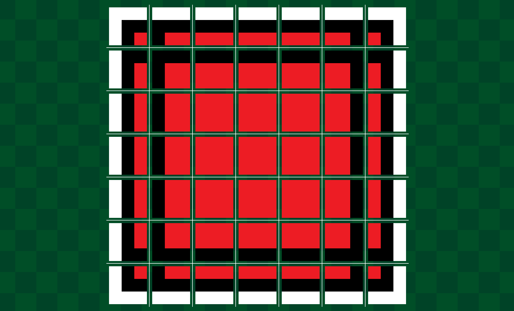
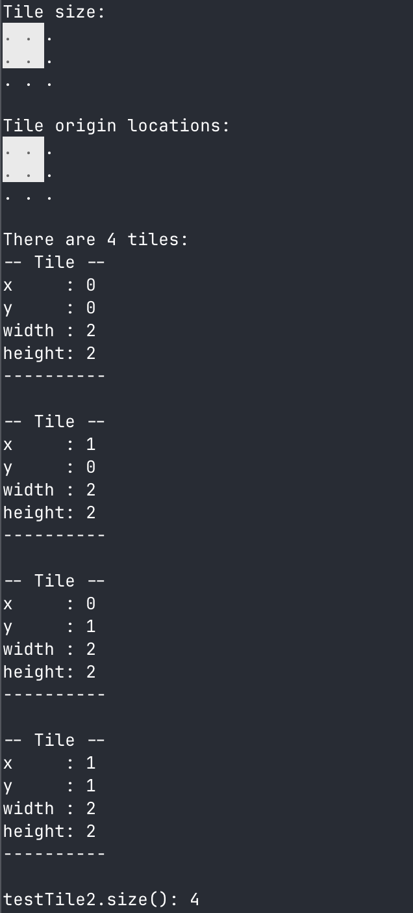
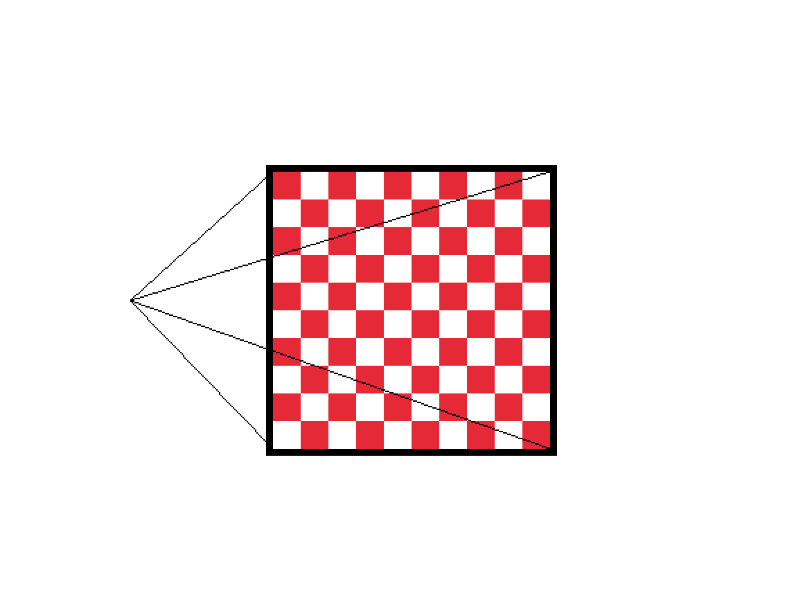

# Capstone Project - Wave Function Collapse Image Generator

A C++ procedural generation tool built with raylib that implements the Wave Function Collapse (WFC) algorithm for creating new images from sample inputs. This project extracts tile patterns from source images and uses constraint-based generation to produce novel outputs that maintain visual coherence with the original.

## Project Overview

This capstone project implements a complete Wave Function Collapse pipeline: extracting overlapping tile patterns from input images and using those patterns with adjacency constraints to procedurally generate new, similar-looking images. The WFC algorithm, inspired by quantum mechanics concepts, uses constraint propagation and entropy-based selection to ensure generated outputs are locally similar to the input while being globally unique.

**Current Status**: WIP - Tile infrastructure complete, WFC algorithm in progress

## Visual Examples

### Pattern Extraction Visualizer
<p align="center">
  
  
</p>
<p align="center"><i>Pattern extraction visualization showing tile boundaries overlaid on sample images (Dungeon and Flowers)</i></p>

### Tile Utility Demonstrations
<p align="center">
  
  
</p>
<p align="center"><i>Tile extraction system processing different sample images for WFC pattern analysis</i></p>

## What is Wave Function Collapse?

Wave Function Collapse is a constraint-based procedural generation algorithm that produces images by analyzing patterns in a sample image and using those patterns to generate new, coherent outputs.

**How it works**:
1. **Pattern Extraction**: Analyzes the input image by extracting all overlapping NxN tile patterns
2. **Constraint Learning**: Records which patterns can appear adjacent to each other based on the input
3. **Entropy-Based Generation**: Iteratively selects positions with lowest Shannon entropy (fewest possibilities) to collapse
4. **Constraint Propagation**: When a tile is placed, propagates constraints to neighbors, eliminating impossible patterns
5. **Backtracking**: If contradictions occur, backtracks to try alternative tile placements

This project implements the **Overlapping Model** of WFC, which works at the pixel level to maintain fine-grained visual coherence with the source material.

## Core Components

### 1. Tile System (`tile.h` / `tile.cpp`)

The fundamental data structure representing a rectangular tile region.

**Features**:
- Stores tile coordinates (x, y) and dimensions (width, height)
- Multiple constructors for flexible tile creation
- Conversion to raylib Rectangle format via `generateRec()`
- Stream output operator for easy debugging
- Methods for setting dimensions and coordinates

**Example Usage**:
```cpp
tile myTile(10, 20, 32, 32);  // x=10, y=20, width=32, height=32
Rectangle rect = myTile.generateRec();
```

### 2. Cell System (`cell.h` / `cell.cpp`)

The core WFC data structure representing each grid position in the output image during generation.

**Features**:
- Manages cell state: collapsed (selected) or superposition (multiple possibilities)
- Stores vector of possible tiles that could exist at this position
- Tracks selected tile once the cell is collapsed
- Calculates rough color estimation for visualization of uncollapsed cells
- Pixel tolerance for constraint matching during propagation
- Methods for tile selection and constraint updates

**Key Members**:
- `isSelected`: Boolean indicating if cell has been collapsed to a single tile
- `possibleTiles`: Vector of tiles that satisfy all constraints at this position
- `selectedTile`: The chosen tile after collapse
- `roughColor`: Averaged color of possible tiles for visualization
- `pixelTolerence`: Threshold for color matching during constraint propagation

**Example Usage**:
```cpp
cell myCell(true);  // Create cell with rough color generation enabled
myCell.possibleTiles.push_back(tile(0, 0, 3, 3));  // Add possible pattern
Color preview = myCell.getCellColor();  // Get visualization color
```

**WFC Role**: Each cell represents one position in the output grid. During generation, cells start with all possible patterns and are progressively constrained until collapsed to a single tile choice.

### 3. Tile Utilities (`tileUtils.h` / `tileUtils.cpp`)

Core utilities for pattern extraction and WFC preprocessing.

**Key Functions**:
- `genTileList()`: Generates all overlapping tile positions from an input image for pattern extraction
  - Configurable tile dimensions for different pattern sizes (typical: 3x3, 5x5)
  - Overlap handling critical for the overlapping model of WFC
  - Debug visualization showing extraction grid in console
  - Returns vector of tile objects representing every possible pattern position
- `checkCLA()`: Command-line argument validation for image file paths
- `drawCheckeredBackground()`: Renders transparency visualization for generated outputs


*Tile utility system extracting patterns from a dungeon tileset*

### 4. Pattern Extraction Visualizer (`drawImage.cpp`)

Development tool for visualizing how the WFC algorithm divides input images into overlapping patterns.

**Features**:
- Loads sample images for WFC pattern analysis
- Automatic scaling while maintaining aspect ratio (95% of window space)
- **Critical for WFC**: Overlays a pixel-accurate grid showing pattern extraction boundaries
- Real-time visualization of tile/pattern dimensions
- Helps verify correct pattern extraction before running WFC generation
- Displays image filename and dimensions for debugging
- Command-line support: `./drawImage --image path/to/sample.png`

**Visual Elements**:
- Red grid lines showing overlapping pattern boundaries (essential for WFC tuning)
- Semi-transparent checkered background for transparency handling
- Text overlays with bordered backgrounds for readability
- 1000x720 window optimized for pattern inspection

**WFC Usage**: Use this tool to verify your input images and determine optimal tile sizes before running pattern extraction.


*Example output showing tile boundary visualization for pattern extraction analysis*

### 5. Graphics Test Application (`demoApp.cpp`)

**Note**: This is NOT a demo of the WFC system. This is a simple graphics library test to verify your environment is set up correctly.

**Purpose**:
- Verifies raylib is properly installed and linked
- Tests basic rendering functionality (shapes, colors, interaction)
- Ensures your machine can run the graphics pipeline before developing WFC features

**Features**:
- Interactive checkered grid with scaling (hold spacebar)
- Mouse tracking with visual feedback
- Simple graphics primitives testing

**When to use**: Run this FIRST when setting up the project on a new machine to ensure raylib works before attempting to build the actual WFC tools.


*Simple graphics test application - not related to WFC functionality*

### 6. Test Suite

- **tileUtilsTest.cpp**: Unit tests for pattern extraction logic
- **tileUtilsVisual.cpp**: Visual verification of tile generation algorithms

## WFC Implementation Status

### Completed
- Tile data structure for pattern representation
- Pattern extraction infrastructure (`genTileList`)
- Visual debugging tools for tile boundaries
- Image loading and preprocessing pipeline
- Grid visualization for pattern verification

### In Progress
- Overlapping pattern extraction from sample images
- Adjacency constraint learning algorithm
- Pattern frequency analysis and storage
- Entropy calculation for cell selection

### Planned (Roadmap)
- Core WFC constraint propagation engine
- Backtracking mechanism for contradiction handling
- Output image generation from collapsed patterns
- Multi-threaded constraint solving for performance
- Interactive WFC visualization (watch generation in real-time)
- Pattern database caching for faster subsequent generations
- Configurable output dimensions independent of input size
- GUI for WFC parameter tuning (tile size, rotation, reflection symmetries)

## Building the Project

The project uses a makefile for compilation. Navigate to the `src/` directory:

```bash
cd src/
make current        # Builds cell (current development target for WFC work)
make all           # Builds all executables
make demoApp       # Builds graphics test only (for verifying raylib installation)
make drawImage     # Builds pattern extraction visualizer (main WFC tool)
make clean         # Removes all built executables
```

**Build Order Recommendation**:
1. `make demoApp` - Build and run this first to verify your graphics environment
2. `make drawImage` - Build the main WFC pattern visualization tool
3. `make all` - Build everything once environment is verified

**Requirements**:
- C++ compiler (clang++ by default, configurable in makefile)
- raylib library (included in `lib/libraylib.a`)
- macOS frameworks: CoreVideo, IOKit, Cocoa, GLUT, OpenGL

## Running the Applications

### Graphics Test (First Time Setup)
```bash
./demoApp
```
**Run this first on a new machine** to verify raylib is working correctly. This is NOT a WFC demo - just a graphics library test. If you see an interactive checkered grid, your environment is ready.

### Pattern Extraction Visualizer (Main Tool)
```bash
./drawImage                              # Visualize default sample (assets/City.png)
./drawImage --image assets/Flowers.png   # Analyze different sample image
./drawImage --image path/to/sample.png   # Custom WFC input image
```

Use this to:
- Inspect sample images that will be used for pattern extraction
- Determine optimal tile/pattern sizes (visible in red grid overlay)
- Verify image quality and resolution before WFC processing

## Use Cases & Applications

### Procedural Content Generation
- **Texture Synthesis**: Generate infinite variations of textures from a single sample (wood, stone, fabric patterns)
- **Pixel Art Generation**: Create new pixel art assets that match the style of existing sprites
- **Level Design**: Generate tile-based game levels (dungeons, cities, terrain) that maintain visual coherence
- **Background Creation**: Produce unique backgrounds for games while preserving artistic style

### Game Development
- **Asset Expansion**: Turn a small set of hand-crafted tiles into large, varied levels
- **Procedural Worlds**: Generate infinite map variations from sample terrain chunks
- **Prototype Testing**: Quickly generate level variations to test game mechanics

### Art & Design
- **Pattern Exploration**: Discover new variations of existing visual patterns
- **Texture Libraries**: Build large texture sets from minimal source material
- **Generative Art**: Create unique artworks using constraint-based generation

### Educational
- **Algorithm Visualization**: Understand constraint propagation and entropy-based selection
- **Procedural Generation**: Learn how modern games create infinite content
- **Computer Graphics**: Study image synthesis and pattern analysis techniques

## Technical Approach

### Overlapping Model Implementation

This project uses the **Overlapping Model** variant of Wave Function Collapse, which operates at the pixel level:

1. **Pattern Extraction Phase**
   - Slide an NxN window across the input image
   - Extract every possible overlapping pattern
   - Store pixel data and calculate pattern frequency
   - Build adjacency rules: for each pattern, record which patterns can appear above, below, left, and right

2. **Constraint Database**
   - Hash table mapping pattern IDs to pixel data
   - Adjacency matrix storing valid neighbor relationships
   - Frequency weights for entropy calculation

3. **Generation Phase**
   - Initialize output grid with all patterns possible at each position
   - Loop until fully collapsed:
     - Calculate Shannon entropy for each uncollapsed cell
     - Select cell with minimum entropy (most constrained)
     - Choose pattern based on weighted random selection using frequencies
     - Propagate constraints to neighbors (remove impossible patterns)
     - If contradiction detected, backtrack and try alternative

4. **Rendering**
   - Convert collapsed pattern IDs back to pixel data
   - Stitch overlapping patterns together
   - Export final generated image

### Key Algorithms
- **Shannon Entropy**: `H = -Σ(p * log(p))` where p is pattern probability
- **Constraint Propagation**: Breadth-first search updating neighbor possibilities
- **Pattern Hashing**: For fast pattern comparison and lookup

## Technologies Used

- **Language**: C++ (for performance-critical constraint solving)
- **Graphics Library**: [raylib](https://www.raylib.com/) - Lightweight library for rendering and image I/O
- **Build System**: GNU Make
- **Platform**: macOS (portable to Windows/Linux with raylib support)
- **Data Structures**:
  - Vector-based tile storage for pattern extraction
  - Hash maps for pattern lookup (planned)
  - Adjacency matrices for constraint storage (planned)
- **Algorithms**:
  - Wave Function Collapse (Overlapping Model)
  - Shannon entropy calculation
  - Constraint propagation
  - Backtracking search

## Learn More About WFC

Wave Function Collapse has become a cornerstone algorithm in procedural generation. Here are excellent resources for understanding the algorithm:

- [Original WFC Implementation by mxgmn](https://github.com/mxgmn/WaveFunctionCollapse) - The canonical implementation with visual examples
- [Procedural Generation with WFC - Vectrx](https://vectrx.substack.com/p/wave-function-collapse) - Detailed tutorial with step-by-step explanations
- [WFC Tips and Tricks - Boris the Brave](https://www.boristhebrave.com/2020/02/08/wave-function-collapse-tips-and-tricks/) - Practical implementation advice
- [WFC Algorithm Explanation - GridBugs](https://www.gridbugs.org/wave-function-collapse/) - Technical deep dive into the algorithm

## Project Structure

```
capstone/
├── header/           # Header files
│   ├── cell.h
│   ├── tile.h
│   ├── tileUtils.h
│   └── raylib.h
├── src/              # Source files and makefile
│   ├── cell.cpp
│   ├── cellTest.cpp
│   ├── tile.cpp
│   ├── tileUtils.cpp
│   ├── drawImage.cpp
│   ├── demoApp.cpp
│   ├── tileTest.cpp
│   ├── tileUtilsTest.cpp
│   ├── tileUtilsVisual.cpp
│   └── makefile
├── lib/              # Libraries
│   ├── libraylib.a
│   └── raylib/       # Full raylib source
├── assets/           # Sample images for WFC training
│   ├── City.png            # Pixel art city sample
│   ├── Dungeon.png         # Tile-based dungeon
│   ├── Flowers.png         # Organic pattern sample
│   ├── cat.jpg
│   └── chat.png
├── resources/        # Documentation screenshots
│   ├── demoApp.png              # Graphics test screenshot
│   ├── drawImageDungeon.png     # Pattern extraction on dungeon
│   ├── drawImageFlower.png      # Pattern extraction on flowers
│   ├── tileDemo.png             # Tile boundary visualization
│   ├── tileUtilDungeon.png      # Tile utility processing dungeon
│   ├── tileUtilVisualCity.png   # Tile utility on city
│   └── tileUtilVisualFlower.png # Tile utility on flowers
└── tests/            # Test files
```

---

**Note**: This is a work-in-progress capstone project. The tile infrastructure is complete, and the WFC algorithm is actively being developed. Contributions and suggestions welcome as the project evolves.
